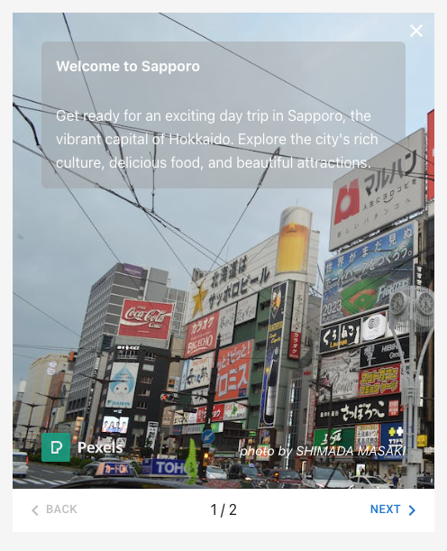
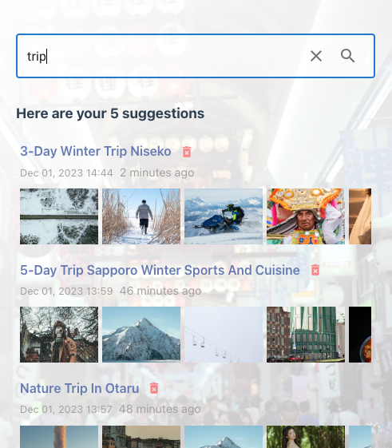
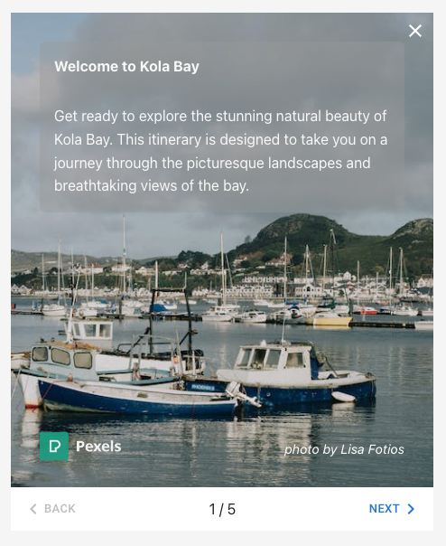
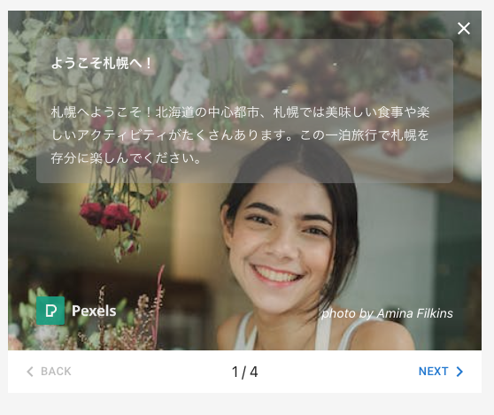
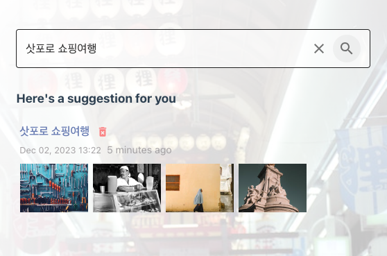
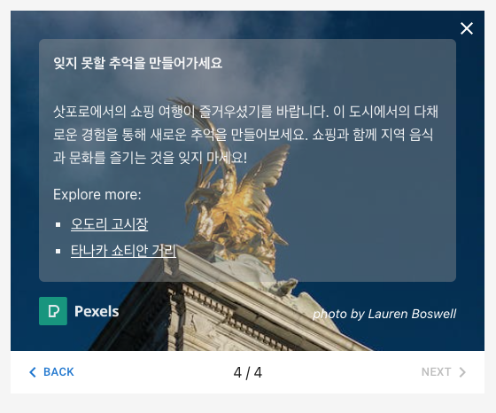
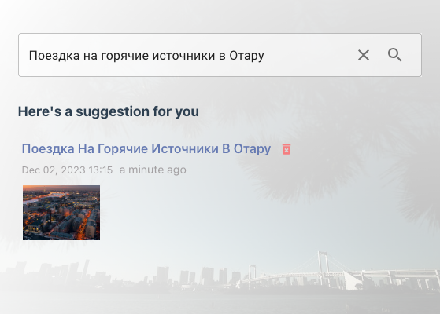
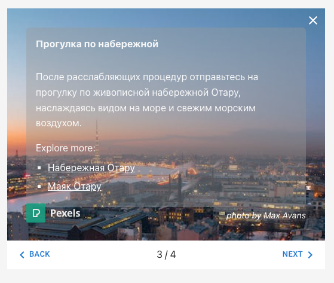

mytrip-hokkaido-app
======

v0.0.2

This sample project is a regional travel planning app that uses artificial intelligence to generate itineraries based on user text, powered by [OpenAI Chat Completions API](https://platform.openai.com/docs/guides/text-generation/chat-completions-api), built using **Next.js 13**.

---

このサンプルプロジェクトは、ユーザーテキストに基づいて旅行の計画を立てるために人工知能を使用する地域旅行計画アプリです。[OpenAI Chat Completions API](https://platform.openai.com/docs/guides/text-generation/chat-completions-api)によりパワードされ、**Next.js 13**を使用して構築されています。


**Updated**: 
* Using [v4.20.1 OpenAI Node module](https://www.npmjs.com/package/openai).
* You can now [customize the location](#customize-location)!
* Added [different language support](#language-support) for the output!


# Application



Simply input your desired activities and specify a location within the current region. All generated itineraries are saved in **localStorage** and will be suggested during keyword searches.




# Customize Location

You can now change the default location by editing the `APP_LOCATION` environment variable in the **.env** file.

```
APP_LOCATION=Hokkaido, Japan
```

I recommend using a broader region rather than a specific city for more itinerary options. For instance, consider using ***Maharashtra, India***, instead of ***Mumbai, India***.


## Sample Location - Murmansk, Russia

Here’s a demonstration of what happens when we set the `APP_LOCATION` to **Murmansk, Russia**.


Itinerary screen




# Language Support

After enabling location customization, it becomes necessary to let the language of user input to dictate the output. 

Here are several examples of the screens in different languages:

* Japanese: 札幌、一泊、ジンギスカン、カラオケ (Sapporo, Overnight, Jingisukan, Karaoke)




* Korean: 삿포로 쇼핑여행 (Shopping trip in Sapporo)




* Russian: Поездка на горячие источники в Отару (Hot spring trip in Otaru)





# Chat Completions API

I have refactored and optimized the code from the previous version of this app, particularly focusing on improving the efficiency of API calls.

First, I implemented **function calling** to verify whether the given location falls within the specified region.

```javascript
{
    "name": "get_place",
    "description": "Extract name of place and theme or activity for the trip in the given texts and check if it is located in Hokkaido, Japan.",
    "parameters": {
        "type": "object",
        "properties": {
            "place": {
                "type": "string",
                "description": "The name of the actual geographical location for the trip. This should be a recognized place name such as a town, city, region, country, or state. Abstract or generic locations like 'countryside' are not accepted."
            },
            "itinerary": {
                "type": "string",
                "description": "The theme or activity that the user is interested"
            },
            "language": {
                "type": "string",
                "description": "The primary language used in the user textin ISO 639-1 code"
            },
            "isLocationValid": {
                "type": "boolean",
                "description": "Flag that tells whether the place is located in Hokkaido or not."
            }
        },
        "required": [ "place", "itinerary", "language", "isLocationValid" ]
    }
}
```

This function serves as the primary workhorse for the application. It's worth noting the various parameters it accepts, aside from **place** and **language**. These additional parameters play a crucial role in generating the output. For instance, the **language** parameter determines the language of the output.

If **isLocationValid** is TRUE, I proceed to submit either the exact user query or utilize the itinerary and place from the result of the function call in the next API call. Unlike the initial function call, this next API call does not involve any additional function calls. Instead, we have prepared a JSON output and enabled **response_format**.

```javascript
const response = await openai.chat({
    response_format: { type: "json_object" },
    messages
})
```

When configuring **response_format** using JSON, it is important to explicitly instruct the AI to output JSON in the system prompt. Failure to do so may result in unexpected outcomes.

```javascript
const system_prompt = `You are a helpful travel planner specializing in ${APP_PLACE_NAME} and designed to output json.\n` +
    `Your output is to an API.\n` +
    `Create valid json complying to the schema.\n\n` +
    `# language\n` +
    `Please write reply in ${language_text} language.\n\n` +
    `Today is ${new Date()}.\n\n` +
    `# json output schema\n` +
    JSON.stringify(output_schema, null, 2)
```

We also included the JSON schema for the output to provide clarity and structure.

```javascript
{
    "$schema": "http://json-schema.org/draft-07/schema#",
    "type": "object",
    "properties": {
        "title": {
            "type": "string",
            "description": "main title for the whole itinerary"
        },
        "welcome": {
            "type": "object",
            "description": "welcome panel",
            "properties": {
                "title": {
                    "type": "string",
                    "description": "title for introduction message"
                },
                "text": {
                    "type": "string",
                    "description": "introduction message about the itinerary"
                },
                "image": {
                    "type": "string",
                    "description": "image keyword for welcome panel"
                }
            },
            "required": ["title", "text", "image"]
        },
        "itineraries": {
            "type": "array",
            "description": "itinerary item",
            "items": {
                "type": "object",
                "properties": {
                    "title": {
                        "type": "string",
                        "description": "title for itinerary"
                    },
                    "text": {
                        "type": "string",
                        "description": "description of itinerary"
                    },
                    "image": {
                        "type": "string",
                        "description": "image keyword for itinerary panel"
                    },
                    "places": {
                        "type": "array",
                        "description": "notable places to included in this itinerary",
                        "items": {
                            "type": "string"
                        }
                    }
                },
                "required": ["title", "text", "image", "places"]
            }
        },
        "closing": {
            "type": "object",
            "description": "closing panel",
            "properties": {
                "title": {
                    "type": "string",
                    "description": "title for closing message"
                },
                "text": {
                    "type": "string",
                    "description": "closing message about the itinerary"
                },
                "image": {
                    "type": "string",
                    "description": "image keyword for closing panel"
                },
                "places": {
                    "type": "array",
                    "description": "notable places to from all itineraries",
                    "items": {
                        "type": "string"
                    }
                }
            },
            "required": ["title", "text", "image", "places"]
        }
    },
    "required": [
        "title",
        "welcome",
        "itineraries",
        "closing"
    ]
}
```


# Images

To generate the images for the itinerary, I will be using [Pexels API](https://www.pexels.com/api/documentation/?language=javascript).
You can use [Pexels Node.js library](https://github.com/pexels/pexels-javascript) to access the API.

```sh
npm install pexels
```

I will be using `Pexels API` photo search function

```javascript
import { createClient } from "pexels"

const client = createClient(process.env.PEXELS_API_KEY)

client.photos.search({ query, per_page: 3 }).then((photos) => {
    console.log(photos)
})
```

Please be aware of the [rate-limit of Pexels API](https://www.pexels.com/api/documentation/?language=javascript#guidelines).


# Setup

Clone the repository and install the dependencies

```sh
git clone https://github.com/supershaneski/mytrip-hokkaido-app.git myproject

cd myproject

npm install
```

Copy `.env.example` and rename it to `.env` then edit the `OPENAI_API_KEY` and `PEXELS_API_KEY` use your own API keys. 
If you want to change the region, please also edit `APP_LOCATION`.

```javascript
OPENAI_API_KEY=YOUR-OPENAI-API-KEY
PEXELS_API_KEY=YOUR-PEXELS-API-KEY
APP_LOCATION=Hokkaido, Japan
```

Then run the app

```sh
npm run dev
```

Open your browser to `http://localhost:4000/` to load the application page.
