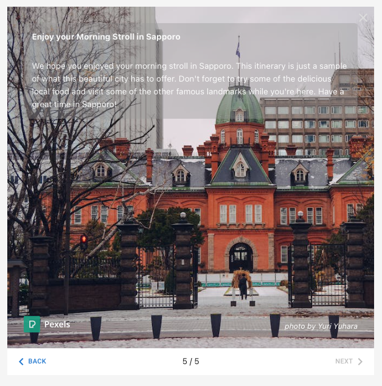

mytrip-hokkaido-app
======

A proof-of-concept Travel Planning app that allows users to create itinerary based on their interests using [OpenAI APIs](https://platform.openai.com/docs/introduction/overview).

The application is built using Next.js 13, powered by the OpenAI API, and supports Japanese language settings (日本語対応).

# Application

Type the location and activity you want to do anywhere in Hokkaido, the app will generate the itinerary.



Sample itinerary


# Code

The app uses several OpenAI APIs (Text Completion and Chat APIs).

* Extracting location and activity from user inquiry
* Checking whether the location is within Hokkaido
* Generating the itinerary based on submitted inquiry


# Images

To generate the images from the itinerary, I will be using another external API.
Initially, I was thinking of using [Bing Image Search API](https://www.microsoft.com/en-us/bing/apis/bing-image-search-api) but decided to [Pexels API](https://www.pexels.com/api/documentation/?language=javascript) for ease of use.

To help us to access `Pexels API`, I will be using their [Pexels Node.js library](https://github.com/pexels/pexels-javascript):

```sh
npm install pexels
```

I will be using `Pexels API` photo search function

```javascript
import { createClient } from "pexels"

const client = createClient(process.env.PEXELS_API_KEY)

client.photos.search({ query, per_page: 3 }).then((photos) => {
    console.log(photos)
})
```


# Setup

Clone the repository and install the dependencies

```sh
git clone https://github.com/supershaneski/mytrip-hokkaido-app.git myproject

cd myproject

npm install
```

Copy `.env.example` and rename it to `.env` then edit the `OPENAI_API_KEY` and use your own `OpenAI API key`.

```javascript
OPENAI_API_KEY=YOUR-OPENAI-API-KEY
```

Then run the app

```sh
npm run dev
```

Open your browser to `http://localhost:4000/` to load the application page.
